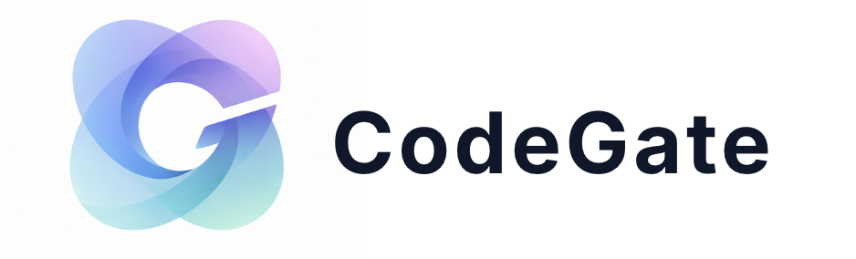

<div align="center">



# CodeGate  
### Guardrails for AI Agents

Prevent hallucinated and malicious dependencies from executing at runtime.


[](https://opensource.org/licenses/MIT)
[](https://www.python.org/)
[](https://firecracker-microvm.github.io/)
[]()

**Guardrails that stop AI agents from installing malicious dependencies.**


CodeGate prevents hallucinated and malicious dependencies from executing when AI agents run `pip install`. 
It works at runtime, requires no agent integration, and is fully opt-in.

</div>

---

## Quick demo (30 seconds)

```bash
pip install codegate-cli
codegate activate

pip install requests     # ✅ allowed
pip install dotenv       # ⛔ blocked
```

Output:
```
Blocked by CodeGate (known hallucination):
  dotenv → use python-dotenv instead

```

---

## Why this exists

Autonomous coding agents generate and execute code at runtime.  
Unlike humans, LLMs frequently hallucinate dependency names or suggest unsafe packages.

Attackers register those names on PyPI (slopsquatting) to deliver malware.

If an agent runs `pip install` on a hallucinated name, your machine is compromised instantly.

CodeGate blocks those installs before they execute.

---

## What CodeGate does

**Does**
- Intercepts `pip install` at runtime
- Blocks known hallucinations and slopsquatting attacks
- Optionally enforces a remote security policy
- Works with any AI agent or coding tool

**Does NOT**
- Hijack your system globally
- Run invisibly or auto-update
- Require blind trust
- Depend on agent behavior

---

## How it works

1. `codegate activate` installs a guarded pip shim in PATH
2. Any `pip install` is intercepted before execution
3. Known hallucinated or malicious packages are denied before execution
4. Unknown packages are evaluated against explicit execution policies
5. Allowed installs are delegated to the real `pip`

CodeGate only affects environments where it is explicitly activated.

---

## Installation

```bash
pip install codegate-cli
```

Activate CodeGate:

```bash
codegate activate
```

---

## Usage (recommended)

```bash
pip install numpy
pip install requests

```

If the agent runs `pip install`, CodeGate is enforced.

---

## Strict mode (CI / production)

```bash
codegate activate --strict
```

Strict mode fails closed:  
if the security scanner is unreachable or denies a dependency, the installation is blocked.

## Scoped execution (advanced)

If you want to limit enforcement to a single command or process:

```bash
codegate run -- pip install numpy
codegate run -- python my_agent.py
```
---

## MCP (Agent Integration)

CodeGate can optionally expose its policy decisions to autonomous agents
via the Model Context Protocol (MCP).

This allows agents to check whether a dependency is allowed
*before* attempting installation.

Agent integration is optional — CodeGate enforces policies
even without agent awareness.

See: https://github.com/dariomonopoli-dev/codegate-mcp
---

## Trust model

CodeGate is intentionally opt-in and inspectable.

- Shims are readable shell scripts
- Enforcement happens only when invoked
- No mandatory global PATH hijacking
- Fully open source

---


## Firecracker & isolation (roadmap)

CodeGate is designed to support runtime isolation for unknown packages  
(using Firecracker MicroVMs and network confinement).

This repository currently focuses on runtime interception and policy enforcement.

---

## License

MIT License © 2025 CodeGate
