<div align="center">

# 🛡️ CodeGate
### The Runtime Supply Chain Firewall for AI Agents

[](https://opensource.org/licenses/MIT)
[](https://www.python.org/)
[]()
[](https://firecracker-microvm.github.io/)

**Prevents "Slopsquatting" and Hallucinated Package Attacks in Real-Time.**

[Report Bug](https://github.com/dariomonopoli-dev/codegate-cli/issues) · [Request Runtime Access](mailto:jerryscout71@gmail.com)

</div>

---

## 🚀 Quick Start (Scanner)

Instantly scan a package or requirements file for **Hallucinations** (non-existent packages).

Install from PyPI:

- PyPI: https://pypi.org/project/codegate-cli/

```bash
pip install codegate-cli
```

Run the scanner:

```bash
codegate scan requirements.txt
```

Example output:

```plaintext
🔍 Analyzing 'zeta-decoder'...
❌ [CRITICAL] Package NOT FOUND on PyPI (Hallucination Detected).
⚠️ Risk: High probability of future typosquatting.
⛔ Installation Blocked by CodeGate Policy.
```

## ⚠️ The Problem: Agents are Compromising Themselves

AI coding agents (ChatGPT, Devin, Copilot) generate and execute code at runtime. Unlike human developers, they often **hallucinate** package names that look real but do not exist.

The Statistic: LLMs hallucinate package names **21.7%** of the time (Spracklen et al., 2024).

The Attack: Attackers register these hallucinated names (e.g., huggingface-cli vs huggingface-hub) to inject malware.

The Gap: Static scanners (Snyk, Dependabot) fail here because the malicious import is generated dynamically.

## 🏗️ Architecture: The Runtime Engine

CodeGate moves security from the CI/CD pipeline to the Kernel. It uses a Zero Trust architecture where every dependency installation is isolated.

```mermaid
graph TD
    A[🤖 AI Agent] -->|pip install pkg| B[🛡️ CodeGate Interceptor]
    B --> C{Analysis Engine}
    C -->|Step 1| D[PyPI Metadata Check]
    D -- 404 Not Found --> E[⛔ BLOCK - Hallucination]
    D -- Package Found --> F[🔥 Firecracker Sandbox]
    F -->|Step 2| G[Execute Install in VM]
    G -- Malicious Behavior --> E
    G -- Clean Execution --> H[✅ Allow Traffic]
```



Interception: An eBPF probe on the network bridge (br0) captures all pip install traffic.

Metadata Filter: Checks PyPI for package existence (404s).

Isolation: Installs the package inside an ephemeral Firecracker MicroVM. If the package tries to exfiltrate keys or touch the host filesystem, the VM is incinerated.

## 🛠️ Usage

### 1. Analyzer (Static Scan)

Check your requirements.txt for "Shadow Dependencies"—packages that are hallucinations.

```bash
codegate scan requirements.txt
```

### 2. Slopsquatting Prober (Active Defense)

Actively probe your LLM to see if it is susceptible to suggesting malicious packages. This tool sends "honeytrap" prompts designed to force hallucinations.

```bash
codegate probe --prompt "I need a Python library to parse X-Financial-98 logs"
```

If the AI suggests a package that doesn't exist, CodeGate alerts you that your agent is vulnerable.

## 📊 Research & Validation

We stress-tested GPT-4 and DeepSeek-Coder with 80 technical prompts.

Result: They suggested 112 unique packages that do not exist on PyPI.

Implication: If an attacker registered these 112 names, they would instantly compromise thousands of local agent workflows.

## License

MIT License. Copyright (c) 2025 CodeGate.
