<div align="center">

# 🛡️ CodeGate
### Zero Trust Runtime for Autonomous AI Agents

[](https://opensource.org/licenses/MIT)
[](https://www.python.org/)
[](https://firecracker-microvm.github.io/)
[]()

**The Supply Chain Firewall for the Agentic Era.**

Prevents "Slopsquatting" and Hallucinated Package Attacks by isolating `pip install` in ephemeral MicroVMs.

[Report Bug](https://github.com/dariomonopoli-dev/codegate-cli/issues) 

</div>

---

## The Demo: Stopping a Runtime Attack

When an AI Agent (like OpenDevin or AutoGPT) tries to install a hallucinated package, CodeGate intercepts the call, spins up a Firecracker VM, and locks the network.

**Terminal Output:**
```text
$ codegate install huggingface-cli

🛡️ [Security Risk] Package 'huggingface-cli' is UNKNOWN.
🔥 Spinning up Firecracker MicroVM for isolation...
⚙️ [Sandbox] Configuring VM Resources...
   └── Kernel Arg Injection: 'pip install huggingface-cli'
   └── Network Tap: tap0 -> Gatekeeper(192.168.1.1:8080)
🚀 [Sandbox] IGNITION. Booting VM...
⏳ Sandboxed Installation in progress (Monitored)...
⛔ [Gatekeeper] BLOCKED: Outbound connection to malicious C2: malicious-analytics.com
✅ Sandbox check complete. Risk mitigated.
💀 VM Destroyed.
```
## The Problem: Agents are Compromising Themselves

AI coding agents generate and execute code at runtime. Unlike human developers, they frequently hallucinate package names.

The Statistic: LLMs hallucinate package names **21.7%** of the time (Spracklen et al., 2024).

The Attack: Attackers register these hallucinated names (e.g., huggingface-cli vs huggingface-hub) to inject malware.

The Failure: Standard `pip install` executes `setup.py` immediately. If an agent installs a malicious package, your host machine (and keys) are compromised instantly.

## 🏗️ Architecture: The Split-Brain Engine

CodeGate moves security from "Scan Time" to "Run Time" using a Zero Trust architecture. It uses a hybrid approach to ensure security without killing performance.

```mermaid
%%{init: {'theme': 'neutral', 'themeVariables': { 'primaryColor': '#ff6347', 'edgeLabelBackground':'#ffffff', 'tertiaryColor': '#f0f0f0'}}}%%
graph TD
    agent[🤖 AI Agent / Dev] -->|pip install pkg| interceptor[🛡️ CodeGate Interceptor]

    subgraph "Host Machine (Decision Engine)"
        interceptor --> check{In Trust Graph?}
        trust[(Cache: Top 5k PyPI)] -.- check
    end

    check -- "✅ Yes (Fast Lane)" --> host_install[🚀 Direct Host Install]
    check -- "❌ No (Slow Lane)" --> isolation[🔥 Spin up Firecracker VM]

    subgraph "Isolated Sandbox (MicroVM)"
        isolation --> vm[📦 Ephemeral VM]
        vm -->|Executes setup.py| net_tap[Network Tap - tap0]
    end

    net_tap -->|Traffic| gatekeeper{🧱 Gatekeeper Proxy}

    gatekeeper -- "pypi.org (Verified)" --> allowed[✅ ALLOW Install]
    gatekeeper -- "malicious.com (C2)" --> blocked[⛔ BLOCK Exfiltration]

    style agent fill:#f9f,stroke:#333,stroke-width:2px
    style host_install fill:#d4edda,stroke:#28a745,color:#155724
    style blocked fill:#f8d7da,stroke:#721c24,color:#721c24
    style gatekeeper stroke:#ff9900,stroke-width:2px,stroke-dasharray: 5 5
```



### 1. The Trust Graph (The Fast Lane)
To solve latency, we maintain a local index of the Top 5,000 PyPI packages (numpy, requests, pandas).

- Verified: These packages bypass the sandbox.

- Performance: 0ms overhead for standard workflows.
  
### 2. The Firecracker Sandbox (The Slow Lane)
Any package that is unknown is forced into isolation.

- Mechanism: We spin up an ephemeral Firecracker MicroVM in <150ms.

- Injection: The pip install command is injected directly into the kernel boot arguments

### 3. The Gatekeeper (The Firewall)
The VM has no internet access except through our local proxy.

- Allowlist: Traffic to pypi.org and files.pythonhosted.org is allowed.

- Blocklist: All other outbound traffic (C2 servers) is dropped.

- Result: Even if malware runs, it cannot "phone home" to exfiltrate secrets.

## 🛠️ Installation & Usage
Prerequisites:
- Linux (for KVM/Firecracker support) OR macOS (Simulation/Dev Mode).
- Python 3.10+

```bash
pip install codegate-cli
```

### Running the Engine

1. Start the Gatekeeper (The Firewall)

```bash
codegate gatekeeper
```

2. Install a Package (The Wrapper)
```bash
codegate install <package_name>
```
## Utilities (Scanner & Prober)
We still include our original research tools for static analysis:
- `codegate scan requirements.txt`: Detects "Shadow Dependencies" (typosquats/hallucinations) in static files.
- `codegate probe`: Actively prompts your LLM to see if it is susceptible to suggesting malicious packages.

## 📊 Research & Validation

We stress-tested GPT-4 and DeepSeek-Coder with 80 technical prompts.

Result: They suggested 112 unique packages that do not exist on PyPI.

Implication: If an attacker registered these 112 names, they would instantly compromise thousands of local agent workflows.

## License

MIT License. Copyright (c) 2025 CodeGate.
